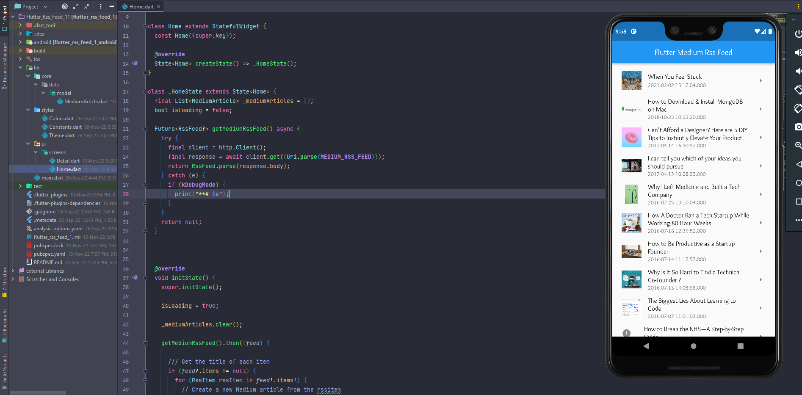
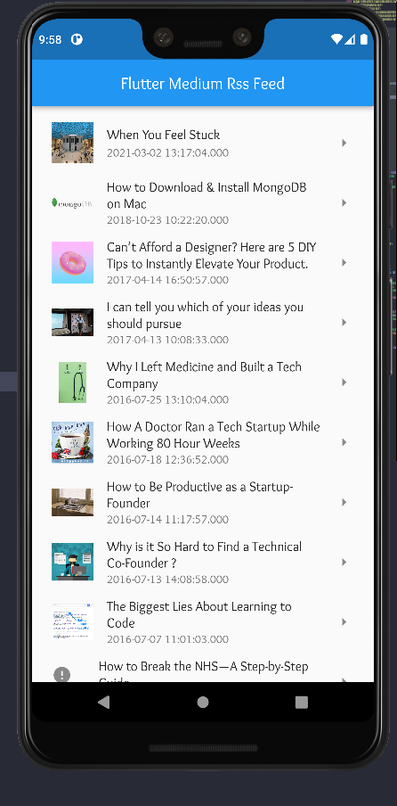

# flutter_rss_feed_2

Flutter RSS Feed App

## Details

This project is a flutter project to demonstrate of connecting to a rss feed and deal with XML types.

steps are:

1. retrieve data
2. put it into models
3. show them in a feed as a list
4. pass the data to next page

The whole purpose of this project is to be as simple as possible and just shows how to work with related packages such as :

* http
* webfeed
* flutter_html

so this project **doesn't** contains any **State Management** or **Architecture**

ScreenShot1:

Screenshot2:

Screenshot3:

